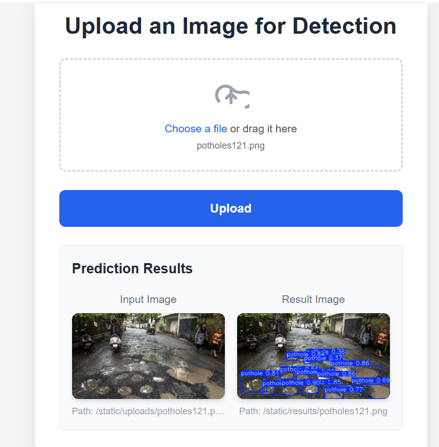

# Pothole Detection

This project uses Ultralytics YOLO for pothole detection in images. It provides a web API built with FastAPI for uploading images and retrieving detection results. The system can be applied to road inspection, intelligent transportation systems, and related fields.


## How to Run

### Step 0: Activate the Environment

```bash
conda activate obj_detect
```

---

### Step 1: Install Dependencies

```bash
pip install -r requirements.txt
pip3 install torch torchvision torchaudio --index-url https://download.pytorch.org/whl/cu126
```

---

### Step 2: Download Dataset

```bash
python download_data.py
```

---

### Step 3: Preprocess Dataset

Convert the dataset to COCO format and split it into training and validation sets:

```bash
python utils/split_raw_data.py
```

---

### Step 4: Train the Model

```bash
python script/finetune.py
```

---

### Step 5: Evaluate the Model

```bash
python script/evaluate.py
```

---

### Step 6: Launch the Web API

```bash
bash script/prep_frontend.sh
uvicorn app.main:app --reload
```

This will start the FastAPI server at:

```
http://127.0.0.1:8000
```

* Web UI: `http://127.0.0.1:8000/`
* API Docs: `http://127.0.0.1:8000/docs`

Here is a sample output:



---

## Project Structure

```
.
├── app/
│   ├── main.py
│   ├── predict_obj.py
│   └── static/
│       ├── index.html
│       ├── uploads/
│       └── results/
├── script/
│   ├── download_data.py
│   ├── finetune.py
│   └── evaluate.py
├── utils/
│   └── split_raw_data.py
├── ckpt/
│   └── (YOLO checkpoint files)
├── requirements.txt
└── README.md
```

---

## Data

Dataset
* Training images: 532
* Validation images: 133

Preparation
* **Format conversion**: Converted from PASCAL VOC format to COCO format to match YOLO11n requirements.
* **Dataset split**: Divided into train / val sets.
* **YOLO11n requirements**: A `data.yaml` file is required to specify the dataset locations.

---

## Model Overview

| Item                  | YOLOv8           | YOLO11x         | YOLO11n         |
| --------------------- | ---------------- | ---------------- | ---------------- |
| **#Parameters**       | \~3.2M           | \~56.9M          | \~7.7M           |
| **Forward Pass Size** | \~1.6GB          | \~16GB           | \~2.2GB          |
| **Optimizer**         | SGD              | AdamW            | AdamW            |
| **Learning Rate**     | 0.01             | 0.01             | 0.01             |
| **Loss Function**     | CIoU + Cls + DFL | CIoU + Cls + DFL | CIoU + Cls + DFL |
| **Batch Size**        | 16               | 16               | 16               |
| **Epochs**            | 100              | 100              | 100              |


### Loss Function
                                                            
| Component    | Description                                                                                                                                                           |
| ------------ | --------------------------------------------------------------------------------------------------------------------------------------------------------------------- |
| **DFL Loss** | Distribution Focal Loss —  helps the model focus more on learning from positive samples|
| **Cls Loss** | Binary Cross-Entropy (BCE) loss — evaluates class prediction accuracy                              |
| **CIoU Loss** | IoU-based loss (e.g., CIoU or SIoU) — measures overlap quality between predicted and ground-truth boxes |


---

## Web API：FastAPI

This project uses FastAPI as a high-performance backend framework to handle image uploads and object detection. It supports asynchronous I/O, automatic API documentation, input validation, and static file serving for the frontend interface.

### Current API Endpoints

| Route       | Method | Description                     |
|-------------|--------|---------------------------------|
| `/`         | GET    | Serves the HTML upload frontend |
| `/predict`  | POST   | Accepts an image and returns the prediction result path |

### System Overview

- Accepts image uploads via `UploadFile` and saves them locally
- Uses a YOLO model to perform object detection
- Saves annotated result images to `static/results/`
- Returns image paths as JSON for rendering on the frontend

### How to Test the API

- Use Swagger UI: [http://localhost:8000/docs](http://localhost:8000/docs)
- Or test with Postman / curl using the `/predict` endpoint

---

## Results

### Performance
| Metric        | YOLOv8  | YOLO11n | YOLO11x |
| ------------- | ------- | -------- | -------- |
| Precision (B) | 0.85399 | 0.81587  | 0.82338  |
| Recall (B)    | 0.70845 | 0.73650  | 0.64850  |
| mAP50 (B)     | 0.81022 | 0.82713  | 0.77412  |
| mAP50-95 (B)  | 0.55191 | 0.55596  | 0.51945  |

---

## Challenges
1. **Bigger model is not always better**
   Despite having significantly more parameters, **YOLO11x** did not outperform the smaller **YOLO11** on all metrics. In particular, YOLO11n achieved higher **precision** and nearly comparable **mAP**, suggesting that lighter models may generalize better on small datasets.

2. **Data format compatibility**
   The original dataset was in **PASCAL VOC** format, which is incompatible with YOLO11nout-of-the-box. It was necessary to convert the dataset to **COCO format** and ensure training.

---
## References

Model architecture
https://github.com/ultralytics/ultralytics/blob/main/ultralytics/cfg/models/11/yolo11.yaml